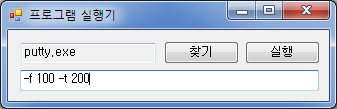

+++
date = "2016-06-17T15:40:57+09:00"
title = "콘솔 프로그램 실행기"
subtitle = "C# Winform을 이용해 파라미터 입력이 가능한 실행기를 만들자"
tags = ["c sharp winform"]
+++

# 사설
영상처리 과제를 할 때였다. 알고리즘의 파라미터를 다양하게 변화시켜 그에 따른 여러 결과를 보여야 했다.  
그런데, 윈도우에서 콘솔 프로그램의 파라미터를 계속 바꾸는 것이 여간 귀찮은게 아니었다. 특히 실행이 끝나면 무의식적으로 cmd 창을 끄는 버릇 때문에, 다시 cmd 창을 켜고 실행 파일 위치까지 이동하는 과정이 너무 귀찮았다.

Batch 파일은 작성하는 방법을 제대로 알지 못했고, 입력 파라미터가 정해진게 아니어서 미리 작업를 예약하는 방식은 쓸 수 없었다.
그렇다고 콘솔 프로그램을 GUI로 새로 작성하기에는 시간이 아깝다.

결국 C# winform을 이용해, 콘솔 프로그램의 위치를 기억하고 파라미터를 입력할 수 있는 간단한 프로그램을 작성하기로 했다.

# 프로그램 스크린샷


# 목표
* 콘솔 프로그램의 위치와 입력했던 파라미터를 기억한다.
* 콘솔 프로그램의 실행 및 파라미터 입력을 GUI 환경에서 수행한다.

## 파라미터 입력 및 실행
내가 원했던 것은, 콘솔 프로그램에 파라미터를 입력하고 실행하면 그 실행 내용과 결과가 cmd 창에 출력되는 모습이었는데, `System.Diagnotics.Process`로 콘솔 프로그램을 직접 실행시켰더니 프로그램 종료와 함께 cmd 창이 닫혔다.  
그래서, cmd부터 실행시키고 cmd에서 콘솔 프로그램을 실행시키는 방향으로 설계해야 했으며, 이는 콘솔 프로그램 및 파라미터가 담긴 명령줄을 cmd의 파라미터로 실행하여 해결했다.

[cmd의 옵션](https://www.microsoft.com/resources/documentation/windows/xp/all/proddocs/en-us/cmd.mspx?mfr=true)을 확인해 보니, cmd에 명령줄을 전달하려면 `/c` 또는 `/k` 옵션을 이용하면 된다.

> /c : Carries out the command specified by string and then stops.  
/k : Carries out the command specified by string and continues.

둘 중 무슨 옵션을 이용해야 할까? 바로 창이 닫히는게 문제니까 `/k` 옵션을 쓰는게 좋을까? 그러나 `/k` 옵션을 이용하면 프로그램 종료 후 다음 명령을 기다리는 프롬프트 화면으로 넘어가기 때문에 창을 수작업으로 닫아줘야 한다. 결과 확인만 하면 되는데 귀찮은 작업이 늘어난다.

결국 `/c` 옵션을 이용해야 하는데, '계속하려면 아무키나 누르세요'를 띄우는게 좋겠다.  
처음 코딩을 배울 때 꼼수로 애용했던 `pause`를 이용하자. cmd를 띄우는 명령과 함께 사용해야 하니 `&`를 이용하면 된다. (여러 명령을 함께 실행하는 방법은 [여기](https://www.microsoft.com/resources/documentation/windows/xp/all/proddocs/en-us/ntcmds_shelloverview.mspx?mfr=true)를 참조)

명령줄은 다음과 같을 것이다.
``` nohighlight
# cmd.exe /c myapp.exe -myparam & pause
```

이를 C# Winform에서 실행해 보자.
``` C#
// using System.Diagnotics;
// appPath: 프로그램 경로. ex) "c:\myapp.exe"
// tb_parameters: 파라미터가 입력된 Textbox.

Process app = new Process();
app.StartInfo.FileName = "cmd.exe";
app.StartInfo.Arguments = "/C " + appPath + " " + tb_parameters.Text + "& pause";
app.Start();
```

이때, `Process`의 작업 디렉토리를 설정해주지 않으면 콘솔 프로그램 **실행기의 위치**가 작업 디렉토리가 되므로, `System.IO.Path.GetDirectoryName`으로 콘솔 프로그램의 위치를 가져와 작업 디렉토리로 설정해주자.  

한 줄만 추가해 주면 된다.
``` C#
// using System.IO;

app.StartInfo.WorkingDirectory = Path.GetDirectoryName(appPath);
```

## 레지스트리 저장
실행했던 콘솔 프로그램의 위치와 파라미터의 기억은 레지스트리를 이용한다.

레지스트리의 저장 위치는 `LOCAL_MACHINE`과 `CURRENT_USER`의 두 가지 선택지가 존재하는데, `LOCAL_MACHINE`은 컴퓨터 전역 / 모든 사용자에게 적용되는 필드로 저장할 때 관리자 권한을 요구한다. `CURRENT_USER`는 사용자 계정에 종속되는 필드로 프로그램의 환경 설정을 저장할 때 일반적으로 사용된다.  

콘솔 프로그램 실행기는 특별한 정보를 저장하는 것이 아니니 `CURRENT_USER` 필드를 이용한다.  
그리고, 일반 소프트웨어는 보통 `Software` 필드를 이용하므로 서브 키를 `Software\\AppLauncher`로 만들자.  
C# 코드 상에선 다음과 같다.
``` C#
// using Microsoft.Win32;

RegistryKey subkey = Registry.CurrentUser.OpenSubKey("Software\\AppLauncher", true);
// 먼저 OpenSubKey로 이미 서브 키가 있는지 확인한다.
// 쓰기를 수행하려면 두 번째 인자로 true를 넘겨줘야 한다.
if (subkey == null)
{
    subkey = Registry.CurrentUser.CreateSubKey("Software\\AppLauncher");
}
```

레지스트리에 저장할 것은 프로그램의 경로와 파라미터이다. 두 값 모두 `string`이므로 `RegistryValueKind.String`으로 지정하여 저장한다.
``` C#
subkey.SetValue("AppPath", appPath, RegistryValueKind.String);
subkey.SetValue("Parameters", tb_parameters.Text, RegistryValueKind.String);
```

레지스트리를 가져올 때는, `object` 객체를 반환하는 `RegistryKey.GetValue`를 이용한다.
``` C#
// using Microsoft.Win32;

RegistryKey subkey = Registry.CurrentUser.OpenSubKey("Software\\AppLauncher");
if (subkey != null)
{
    appPath = subkey.GetValue("AppPath").ToString();
    tb_parameters.Text = subkey.GetValue("Parameters").ToString(); 
}
```

## 끝
핵심 기능을 구현하는 법은 알았으니 프로그램 구조를 적절히 설계만 하면 된다.

콘솔 프로그램을 실행하는 부분은 실행 버튼의 `Click` 이벤트에 구현하면 될 것이고...  
레지스트리를 가져올 때는 `Load` 이벤트를, 기록할 때는 `Form_Closed`를 이용하자.  

# References
* http://www.differencebetween.net/technology/hardware-technology/difference-between-hkey_current_user-and-hkey_local_machine/