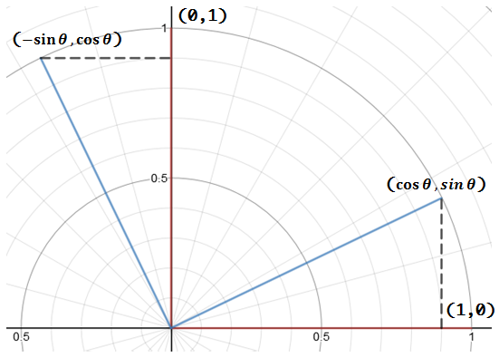

+++
date = "2016-11-15T22:45:08+09:00"
title = "회전 행렬(Rotation matrix) 유도"
subtitle = "선형 변환을 이용한 회전 행렬의 유도"
tags = ["CG", "Math"]
+++

# 사설
회전 행렬(Rotation matrix)은 보통 한 번 구현해 놓고, 사용만 하기 때문에 좀처럼 외워지지 않았다. 특히 `cos`, `sin`의 위치는 기억해도 `-`가 어느 `sin`에 붙는지 자꾸 헷갈렸다.

그래서, 식 자체를 외우기 보다 유도하는 방법을 외우기로 했다.

# 유도
회전 행렬을 유도하는 방법에는 여러가지가 있다. 삼각형의 합동을 이용한 방법(고등수학), 벡터의 내적을 이용한 방법 등.... 이 방법들을 사용해도 전혀 어려울 것은 없지만, 팟 하고 떠올리기엔 조금 무리가 있을 것 같았다.

좀 더 쉬운 유도 방법을 찾아봤더니, 운 좋게도 **가장 쉽다**고 할 수 있을 유도 방법이 있었다. 바로 회전 행렬이 선형 변환(=선형 사상)임을 이용해 유도하는 것이다.

먼저 \\( ( 1, 0 ) \\)과 \\( ( 0, 1 ) \\) 두 벡터를 \\( \theta \\)만큼 회전시켜 보자.

그림과 같이 \\( ( 1, 0 ) \\)을 \\( \theta \\)만큼 회전하면 \\( ( \cos { \theta }, \sin { \theta } ) \\), \\( ( 0, 1 ) \\)을 \\( \theta \\)만큼 회전하면 \\( ( -\sin { \theta }, \cos { \theta } ) \\)이 된다.

그리고, 회전 행렬 \\( R \\)은 선형 변환이므로 다음이 성립한다.

$$
R\begin{bmatrix} x \\ y \end{bmatrix}=R\begin{bmatrix} x \\ 0 \end{bmatrix}+R\begin{bmatrix} 0 \\ y \end{bmatrix}
$$

R(x, y) = R(x, 0) + R(0, y)
= x R (1, 0) + y R (0, 1)
= x (cos t, sin t) + y (-sin t, cos t)
= (cos t, -sin t) (x)
  (sin t, cos t)  (y)

$$
\begin{align*} R\begin{bmatrix} x \\ y \end{bmatrix} &=R\begin{bmatrix} x \\ 0 \end{bmatrix}+R\begin{bmatrix} 0 \\ y \end{bmatrix}\\ &=xR\begin{bmatrix} 1 \\ 0 \end{bmatrix}+yR\begin{bmatrix} 0 \\ 1 \end{bmatrix}\\ &=x\begin{bmatrix} \cos { \theta  }  \\ \sin { \theta  }  \end{bmatrix}+y\begin{bmatrix} -\sin { \theta  }  \\ \cos { \theta  }  \end{bmatrix}\\ &=\begin{bmatrix} \cos { \theta  }  & -\sin { \theta  }  \\ \sin { \theta  }  & \cos { \theta  }  \end{bmatrix}\begin{bmatrix} x \\ y \end{bmatrix} \end{align*}
$$
