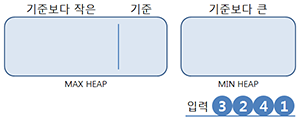
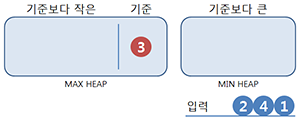
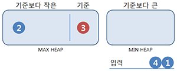
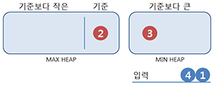
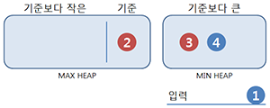
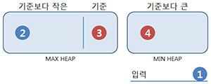
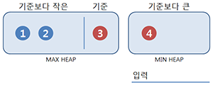
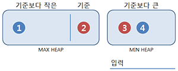

+++
date = "2016-11-12T01:47:05+09:00"
title = "중앙값(Median) 찾기"
subtitle = "Heap을 이용한 중앙값 찾기"
tags = ["Algorithm"]
+++

# 중앙값(Median)
중앙값이란, 어떤 배열을 정렬했을 때 정 가운데에 위치하는 값을 말한다. (수학적으로는 확률분포가 0.5인 값이다.)  
예를들어, `[1, 2, 3]`의 배열에서는 `2`가 중앙값이다.

원소의 개수가 짝수인 경우엔, 가운데 두 원소의 평균이 중앙값이 된다.  
`[1, 2, 3, 4]`에서는 `2`와 `3`의 평균인 `2.5`가 중앙값인 것이다. 

## 중앙값 찾기
중앙값은 **정렬된 배열**에서 찾아야 한다.  
배열이 정렬되어 있다면 땡큐지만, 정렬되어 있지 않다면 정렬해야 하므로, 가장 먼저 정렬을 수행해야 한다.

정렬 후엔, 단순히 배열 크기의 절반에 해당하는 인덱스에 접근해 반환하면 된다.
``` c++
float median(vector<int> &arr){
    sort(arr.begin(), arr.end());

    if(arr.size() % 2 == 1){
        return (float)arr[arr.size() / 2];
    }
    else{
        return ((float)arr[arr.size() / 2] + (float)arr[arr.size() / 2 + 1]) / 2.0f; 
    }
}
```
`int`형 자료를 갖는 배열임에도 `float`형을 반환하는 이유는, 짝수개에 대한 중앙값의 정의 때문이다. 물론 소수점 이하가 필요 없다면 그대로 반환해도 되겠다. 반올림이 아닌 절삭인 것도 감안하고.

## 실시간으로 중앙값 찾기
중앙값을 찾기 위해선 배열의 정렬이 선행되어야 한다. 그렇다면, 데이터가 지속적으로 추가/삭제되고 있는 상황에서 중앙값을 찾으려면 어떻게 해야 할까? 위의 방법을 이용한다면, 중앙값을 찾을 때마다 배열 전체에 대한 정렬을 시도하므로 엄청난 시간 낭비가 아닐 수 없다.

그래서 값을 찾을 때마다 정렬하기 보다는, 자료구조 자체를 바꿔야 하겠다. 수행 속도가 훨씬 빠른, 추가/삭제가 정렬과 함께 이루어지는 자료 구조를 이용하는 것이다. 추가/삭제가 정렬과 함께 이루어지는 자료 구조는 여러가지가 있지만, 중앙값을 찾는 데는 [Heap](https://ko.wikipedia.org/wiki/힙_\(자료_구조\))을 이용할 수 있다.

### 알고리즘
> * Max heap은 최대값에 바로 접근할 수 있다.
> * Min heap은 최소값에 바로 접근할 수 있다.

Heap의 두 성질 이용해, 중앙값보다 작은 값들은 Max heap에, 중앙값보다 큰 값들은 Min heap에 저장하는 방식으로 중앙값을 찾는 알고리즘을 구현할 수 있다. 아래의 상황을 보자.

먼저, 작은 값과 큰 값을 나눌 기준이 필요하다. 중앙값이 아니라 굳이 기준이라 표현한 이유는, 개수가 짝수일 때를 고려해서이다.  
기준은 어차피 가운데에 있으니, 변수를 따로 만들 필요 없이 Max heap 또는 Min heap에 포함시키면 된다. 여기선 Max heap을 이용했다.

첫 번째 입력은 별 수 없이 기준이 된다. 홀수개이므로 중앙값은 `3`이다.  
나머지는 기준보다 작다면 Max heap에, 크다면 Min heap에 넣는다. 그리고, Max heap과 Min heap의 크기가 균형되도록 조절한다. 다만, 기준을 고려해 기준을 가진쪽이 하나는 더 클 수 있도록 허용한다.


`2`는 기준보다 작으니 Max heap에 넣지만 균형을 맞추기 위해 Max heap의 최대값을 이동시킨다. 짝수개이므로 중앙값은 `2`와 `3`의 평균이다. 


`4`는 기준보다 크니 Min heap에 넣지만 균형을 맞추기 위해 Min heap의 최소값을 이동시킨다. 홀수개이므로 중앙값은 `3`이다.


`1`은 기준보다 작으니 Max heap에 넣지만 균형을 맞추기 위해 Max heap의 최대값을 이동시킨다. 짝수개이므로 중앙값은 `2`와 `3`의 평균이다.

입력이 들어올 때마다 한 번의 데이터 이동만으로 실시간으로 중앙값을 찾고 있다. Heap의 시간복잡도가 `O(log N)`이므로 최악의 경우라도 '삽입 + 삭제 + 삽입'의 `O(3 log N)`의 성능을 보인다.

### 구현
Heap을 직접 구현하는 귀찮은 짓을 할 수도 있겠지만, STL에서 이미 `priority_queue`라는 이름으로 제공하고 있으므로 이용하면 된다.
``` c++
priority_queue<int> max_heap;
priority_queue<int, vector<int>, greater<int> > min_heap;
```  
`priority_queue`는 기본으로 선언하면 오름차순 정렬인 Max heap이 된다. `greater<int>`를 템플릿 인자로 주면 내림차순 정렬인 Min heap을 선언할 수 있다.  
두 번째 템플릿 인자는 `priority_queue`의 컨테이너를 결정한다. 무난하게 `vector`로 선언해주면 된다. `priority_queue`에 대한 자세한 설명을 원한다면 [레퍼런스](http://www.cplusplus.com/reference/queue/priority_queue/?kw=priority_queue)를 참고하길 바란다.
  
다음의 코드는 `int number`에 `cin`을 통해서 지속적으로 값을 읽어들이는 상황이라 가정한 것이다.
``` c++
priority_queue<int> smaller; // Max heap
priority_queue<int, vector<int>, greater<int> > bigger; // Min heap

int number;
cin >> number; // 첫 번째 입력.
smaller.push(number); // 기준이 smaller에 있다고 가정하므로, 첫 입력은 smaller에 넣는다.

while(true){
    cin >> number; // 두 번째 이후의 입력.
    if(number < smaller.top()){
        // 기준보다 작은 경우 smaller에 넣는다.
        smaller.push(number);
    }
    else{
        // 기준보다 큰 경우 bigger에 넣는다.
        bigger.push(number);
    }

    // smaller의 크기와 bigger의 크기가 같거나, smaller의 크기가 하나 더 크게 유지되도록 데이터를 옮긴다. 
    if(smaller.size() < bigger.size()){
        smaller.push(bigger.top());
        bigger.pop();
    }
    else if(smaller.size() > bigger.size() + 1){
        bigger.push(smaller.top());
        smaller.pop();
    }

    // smaller와 bigger의 크기가 같다면 총 개수는 짝수이다.
    if(smaller.size() == bigger.size()){
        cout << ((float)smaller.top() + (float)bigger.top()) * 0.5f << endl;
    }
    else{
        cout << smaller.top() << endl;
    }
}
```

## 세 수(Triple)의 중앙값 찾기
퀵정렬을 설계할 때 Pivot을 선택하는 방법에는 여러가지가 있지만, 대표적으로는 임의의 한 원소를 선택하는 방법과 **처음, 중간, 끝의 원소 중 중앙값인 원소를 선택하는 방법**의 두 가지가 있다.

퀵정렬에서 써먹을 수 있도록 세 수 중에서 중앙값을 찾는 방법을 생각해보자.  
기본적인 방법은, 다량의 조건문을 이용해 찾는 것이다.
``` c++
int median(int a, int b, int c){
    if (a > b){
        if (b > c)          return b;
        else if (a > c)     return c;
        else                return a;
    }
    else{
        if (a > c)          return a;
        else if (b > c)     return c;
        else                return b;
    }
}
```
조건부 연산자(`exp?exp:exp`)를 이용하면 코드가 좀 더 짧아지겠지만, 해석하기 어려워 진다.

교환 법칙이 성립되는 XOR의 성질을 이용한다면, 분기 없이 중앙값을 찾을 수도 있다.
``` c++
int median(int a, int b, int c){
    int maximum = max(max(a, b), c);
    int minimum = min(min(a, b), c);
    return a ^ b ^ c ^ maximium ^ minimum;
}
```
세 수 모두를 XOR로 결합하고, 다시 최대값 최소값을 XOR로 제외함으로써 중앙값을 구했다.  
XOR에 관한 내용은 [이 포스트]()를 참조하길 바란다.