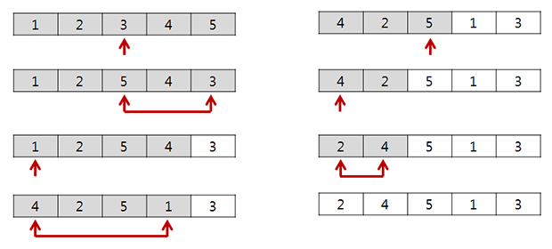

+++
date = "2016-10-20T18:26:57+09:00"
title = "랜덤 뽑기"
subtitle = "배열에서 임의의 원소를 중복되지 않도록 뽑는 방법"
tags = ["Algorithm"]
+++

# 임의의 접근
'임의(랜덤)'라는 말을 들으면 `rand()`를 이용해 무작위로 접근하는 방법이 가장 먼저 떠오를 것이다. 그러나 당연하게도 무작위 접근은 중복 접근을 방지하지 못 한다.    
그렇다면, 중복을 피해서 배열에 임의로 접근하려면 어떻게 해야 할까.

## 방문 여부를 기록하는 방법
가장 손쉽게 생각해낼 수 있는 방법은, 임의 접근하는 배열의 각 원소마다 방문 여부를 기록하고, 중복된 접근이면 새로운 임의 접근을 시도하도록 구현하는 것이다.

코드로 보면 다음과 같다.
``` c++
// arr는 std::vector를 이용한 임의의 배열.

std::vector<bool> visited(arr.size(), false);

int indexToVisit = rand() % arr.size(); // [0, size)
while(visited[indexToVisit]) {
    indexToVisit = rand() % arr.size();
}
visited[indexToVisit] = true;

arr[indexToVisit] ...
```
그러나, 이 방식에는 문제가 있는데, 위 코드에서 볼 수 있듯이 방문 기록이 없는 인덱스가 나올때까지 새로운 접근을 반복 시도한다는 점이다. 이는 방문한 원소의 수가 늘어갈수록, 배열의 크기가 클수록 더 큰 문제가 된다. 배열의 대부분을 방문하고 나면, 무한에 가까운 루프를 시도할지도 모른다.

## 접근 영역을 한정하는 방법
이 문제를, 여러개의 공이 들어있는 주머니에서 임의의 한 개를 뽑는 문제라고 생각해 보자. 공을 뽑을 때 전에 뽑았던 공을 다시 뽑지 않으려면, 뽑은 공을 주머니에 도로 넣지 않고 다른 곳에 보관해두면 된다.  
그러나, 배열에서 이를 적용하기란 쉽지 않은 일이다. 원소를 마음대로 떼었다 붙였다 할 수 있는 것이 아니니까. 그렇다면 어떻게 해야 좋을까? 데이터 스왑을 이용하면 생각보다 간단히 해결할 수 있다.

1. 먼저, 배열 전체를 임의 접근할 수 있는 영역으로 설정해 놓는다.  
2. 방문할 임의의 원소를 영역 내에서 선택하고, 해당 원소를 영역의 끝으로 옮겨놓는다. 동시에 영역의 크기를 한 칸 줄인다.  
3. 옮겨놓은 원소를 사용한다.  
4. 새로운 임의 접근 시, 2-3을 수행한다.

여기서 **원소를 옮긴다**의 의미가, 배열 구조 전체를 수정해야 하는 **제거 후 삽입**이 아닌, **데이터 스왑**을 이용한 방식이란 것이 중요하다.  

아래의 그림을 보면 쉽게 이해할 수 있을 것이다.


바로 코드로 적용해 보자.
``` c++
// arr는 std::vector를 이용한 임의의 배열.

int range = arr.size();
int randomIndex = rand() % range; // [0, range)

// 데이터 스왑.
int temp = arr[randomIndex];
arr[randomIndex] = arr[range - 1];
arr[range - 1] = temp;

--range; // 영역을 줄인다.

arr[range] ...
```
`randomIndex`가 가리키는 영역 내의 임의의 원소와 `range`가 가리키는 영역 끝의 원소를 스왑함으로써, `range`가 영역 내의 임의의 원소를 가리키도록 만들었다.

### 인덱스 배열을 이용
그러나, 이 방법도 결국 데이터 스왑을 통해 배열에 변형을 가하고 있다.  
위 예제와 같이 원본 배열이 변형되어도 되고, 배열에 저장된 데이터가 레지스터를 이용하는 기본 자료형(`int`, `char`, ...)이면 전혀 문제될 것이 없지만, 객체와 같이 데이터 스왑에 필요한 비용이 큰 자료형의 경우엔 성능에 크게 영향을 끼칠 것이다. 그러므로 직접 원본 배열을 이용하는 것 보다는, 따로 임의 접근을 위한 인덱스 배열을 두고 이를 섞어 쓰는 편이 낫다.

물론, 인덱스 배열이 차지하는 메모리도 무시할 수 없지만, 일반적으로 기본 자료형으로 인한 공간 복잡도보다는 객체 복사로 인한 시간 복잡도가 더 큰 문제가 될 것이다.

다음은 클래스화 한 인덱스 배열의 코드이다.
``` c++
class ShuffledIndices{
private:
    std::vector<int> indices;
    int range;
public:
    ShuffledIndices(int size): indices(size), range(size) {
        for(int i=0; i<size; ++i){
            indices[i] = i;
        }
    }

    int getIndex() {
        int randomIndex = rand() % range; // [0, range)

        // 데이터 스왑.
        int temp = indices[randomIndex];
        indices[randomIndex] = indices[range - 1];
        indices[range - 1] = temp;

        // 영역을 줄인다. 더 이상 접근할 영역이 없으면 초기화 한다.
        if(--range < 1){
            range = indices.size();
        }

        return temp;
    }
};
```
생성자에서 배열과 동일한 크기의 인덱스 배열을 만들고, `getIndex()`를 호출할 때마다 임의 접근할 인덱스를 반환한다. 추가된 점은, 더 이상 임의 접근할 영역이 없다면 `range`를 초기화 하고, 다시 인덱스 배열 전체를 이용하도록 만든 것이다. 

아래와 같이 쓰면 된다.
``` c++
// arr는 std::vector를 이용한 임의의 배열.

ShuffledIndices si(arr.size());
for(int i=0; i<arr.size(); ++i){
    arr[si.getIndex()] ...
}
```

## 배열 섞기
목적이 배열을 섞는 것이라면 굳이 인덱스 배열을 쓸 필요가 없다.
``` c++
template <typename type_t>
void shuffle(std::vector<type_t> &arr) {
    int range = arr.size();

    for(int i=0; i<arr.size(); ++i) {
        int randomIndex = rand() % range; // [0, range)

        // 데이터 스왑.
        type_t temp = arr[randomIndex];
        arr[randomIndex] = arr[range - 1];
        arr[range - 1] = temp;

        --range; // 영역을 줄인다.
    }
}
```
`getIndex()`를 조금 변형하여 배열을 섞는 함수를 작성했다. 달라진 점은 원본 배열을 직접 이용한다는 점과 여러 자료형에 적용할 수 있도록 `template`을 사용한 것 뿐이다.
