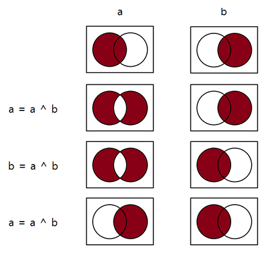

+++
date = "2016-09-20T01:23:50+09:00"
title = "배열 뒤집기"
subtitle = "데이터 스왑에 대한 고찰"
tags = ["Algorithm"]
+++

# 문제
배열 안의 데이터 순서를 역순으로 바꾼다고 하자.  
`['a', 'b,' 'c', 'd']`와 같은 배열을 `['d', 'c', 'b', 'a']`와 같이 뒤집고 싶다는 것이다.  
C#, Python과 같이 사용자 친화적 언어들은 `.reverse()`하면 아주 손쉽게 배열을 뒤집을 수 있지만, C와 같은 언어에서는 한 번쯤 생각해 볼 수 있는 문제이다.

## 새로운 배열에 역순으로 복사
아마도 가장 단순 무식하게 떠올릴 수 있는 방법은, 똑같은 크기의 배열을 새로 만들어서 역순으로 데이터를 옮기는 것이다.
``` c
char new_array[SIZE];
for(i = 0; i < SIZE; ++i) {
    new_array[SIZE - 1 - i] = old_array[i];
}
```
간단히 옮기는 것 까지는 좋았는데, 배열 크기 만큼의 새로운 메모리가 필요하다니 낭비가 너무 심하다. 게다가 원본 저장소 `old_array`를 그대로 사용하고 싶다면 `memcpy`를 추가로 수행해줘야 한다.

뭐, 위 방법을 쓸리는 없고, 그냥 한 번 생각해보자는 것이니까 다음을 보자.

## 데이터 스왑을 이용
일반적으로 사용되는 가장 흔한 형태는, 아래와 같이 데이터 스왑을 이용해서 배열을 뒤집는 방법일 것이다.
``` c
char temp;
for(i = 0; i < SIZE / 2; ++i) {
    temp = array[i];
    array[i] = array[SIZE - 1 - i];
    array[SIZE - 1 - i] = temp;
}
```
배열의 양 끝에서부터 중간 지점까지 각각 차례로 한 칸씩 이동하며 데이터를 교환함으로써 배열의 순서를 뒤집고 있다. 데이터 스왑에는 임시 메모리를 이용한 전형적인 방법이 사용되었다.   
이 정도면 아주 작은 추가 메모리로 원본 저장소도 유지할 수 있고, 연산횟수도 반으로 줄었으니 더할 나위 없어 보인다.

그러나 모종의 변태들은, 새하얀 도화지의 까만 점 처럼 `temp`가 자꾸 눈에 밟히고 치명적인 오점인 것처럼 생각할지도 모른다. 

# 배타적 논리합(XOR)을 이용한 데이터 스왑
비트 연산 XOR을 이용하면 여분의 메모리를 사용하지 않고도 데이터를 교환할 수 있다.
``` c
char a = 'a', b = 'b';
a ^= b;
b ^= a;
a ^= b;
// DONE. a == 'b', b == 'a'.
```
정말 간단하지 않은가? 한 번 [직접 실험](http://cpp.sh) 해보기 바란다.

어떻게 이게 가능한걸까? 이는 배타적 논리합이 갖는, 두 피연산자의 서로 다른 성질만을 남긴다는 점을 교묘하게 이용하고 있기 때문이다.  
`a`가 a와 b의 공통 성질, a만 가지는 성질의 두 가지로 이루어져 있고, `b`는 a와 b의 공통 성질, b만 가지는 성질의 두 가지로 이루어져 있다고 생각하고 위의 코드에 대입해보자.  
``` c
char a = (ab 공통의 성질, a의 유일한 성질), b = (ab 공통의 성질, b의 유일한 성질);
a = (ab 공통, a의 유일) ^ (ab 공통, b의 유일); // -> (a의 유일, b의 유일)
b = (ab 공통, b의 유일) ^ (a의 유일, b의 유일); // -> (ab 공통, a의 유일) == 'a'
a = (a의 유일, b의 유일) ^ (ab 공통, a의 유일); // -> (ab 공통, b의 유일) == 'b'
```
아주 훌륭하게 데이터가 스왑 되었다.

벤 다이어그램으로 보면, 더 쉽게 이해할 수 있다.


## 다른 자료형에의 적용
메모리 내용 자체를 교환하는 방식이니까 어떤 데이터든 교환이 가능할까?  
비트 연산은 정수형 자료형만 가능하므로 일반적으로는 다른 자료형에 적용할 수 없지만, 약간의 트릭으로 실수형 자료형과 같은 다른 자료형에도 적용할 수 있다.

바로 포인터를 이용하는 것이다.
``` c++
float a = 1.0f, b = -1.0f;
*(reinterpret_cast<int *>(&a)) ^= *(reinterpret_cast<int *>(&b));
*(reinterpret_cast<int *>(&b)) ^= *(reinterpret_cast<int *>(&a));
*(reinterpret_cast<int *>(&a)) ^= *(reinterpret_cast<int *>(&b));  
```
캐스트 연산자 때문에 뭔가 복잡해 보이지만, float 자료형이 int 자료형인 것처럼 컴파일러를 속였을 뿐이다.  
비록 정수형 자료형의 크기와 동일한 크기를 가진 자료형만 해당되지만, 어엿하게 실수형 자료형에도 적용할 수 있다는 말이다.

## XOR을 이용하면 정말 빠를까?
그렇다면, XOR을 이용한 방식이 정말 더 좋은지 확인해보자.

먼저 XOR을 이용한 방법의 어셈블리 코드를 보자.
``` c++
; 7    : 	*(reinterpret_cast<int *>(&a)) ^= *(reinterpret_cast<int *>(&b));
  00042	8b 45 f4	 mov	 eax, DWORD PTR _a$[ebp]
  00045	33 45 e8	 xor	 eax, DWORD PTR _b$[ebp]
  00048	89 45 f4	 mov	 DWORD PTR _a$[ebp], eax
; 8    : 	*(reinterpret_cast<int *>(&b)) ^= *(reinterpret_cast<int *>(&a));
  0004b	8b 45 e8	 mov	 eax, DWORD PTR _b$[ebp]
  0004e	33 45 f4	 xor	 eax, DWORD PTR _a$[ebp]
  00051	89 45 e8	 mov	 DWORD PTR _b$[ebp], eax
; 9    : 	*(reinterpret_cast<int *>(&a)) ^= *(reinterpret_cast<int *>(&b));
  00054	8b 45 f4	 mov	 eax, DWORD PTR _a$[ebp]
  00057	33 45 e8	 xor	 eax, DWORD PTR _b$[ebp]
  0005a	89 45 f4	 mov	 DWORD PTR _a$[ebp], eax
```

다음은 임시 메모리를 이용한 방법의 어셈블리 코드이다.
``` c++
; 12   : 	temp = a;
  0005d	f3 0f 10 45 f4	 movss	 xmm0, DWORD PTR _a$[ebp]
  00062	f3 0f 11 45 dc	 movss	 DWORD PTR _temp$[ebp], xmm0
; 13   : 	a = b;
  00067	f3 0f 10 45 e8	 movss	 xmm0, DWORD PTR _b$[ebp]
  0006c	f3 0f 11 45 f4	 movss	 DWORD PTR _a$[ebp], xmm0
; 14   : 	b = temp;
  00071	f3 0f 10 45 dc	 movss	 xmm0, DWORD PTR _temp$[ebp]
  00076	f3 0f 11 45 e8	 movss	 DWORD PTR _b$[ebp], xmm0
```
전자는 후자에 비해 XOR 연산을 위한 CPU 사이클이 하나씩 더 들어가 있다.  
어셈블리 코드를 볼 줄 모른다고 해도, 척 보면 XOR을 이용한 방식의 코드 길이가 3줄 더 많다는 것을 알 수 있다. 이는 CPU의 연산이 세 번 더 수행된다는 뜻이다.  

실제로 얼마나 성능 차가 나는지 실험 결과를 보자.  
다음은 특정 배열에 대해 무작위([분기 예측](https://ko.wikipedia.org/wiki/분기_예측) 방지) 원소 교환을 9999999회 수행하는데 걸린 시간이다. (3.3Ghz CPU)

<center>

| 방법       | 소요 시간 |
| :--------- | :------: |
| XOR        | 42 ms    |
| 임시 메모리 | 15 ms    |

</center>

확실히 임시 메모리를 이용한 방법이 더 빠르긴 하지만, 이 정도의 미미한 차이는 무시할 수 있는 수준이다. 

# 결론
어째 의식이 흐르듯 배열 뒤집기에서 데이터 스왑으로 주제가 바뀐 것 같지만...

아무튼 결론적으로 얘기하자면, 배열을 뒤집을 땐 데이터 스왑을 이용한 방식으로 구현하는 것이 좋고, 데이터 스왑 방식으로는 임시 메모리를 이용하든 XOR을 이용하든 개발자 마음대로 라는 것이다.  
XOR을 이용한 방식은, 알아두면 '이렇게 변태같이 데이터 스왑하는 방법도 있다!' 하고 자랑할 수도 있다.

물론, 영상처리와 같이 10ms가 아쉬운 경우라면 임시 메모리를 이용한 방법이 더 적절하겠지만 말이다.   